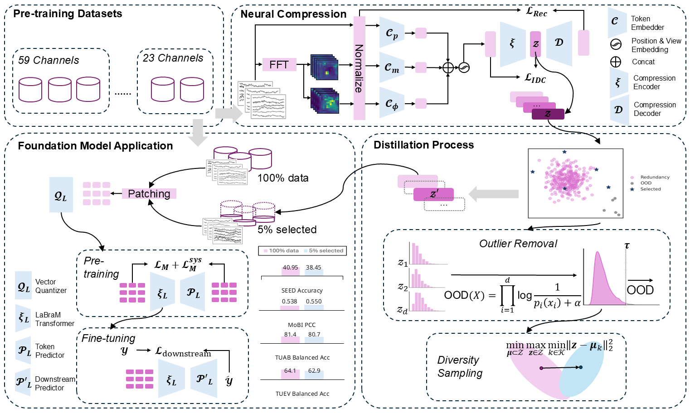

# EEG-DLite: Data Distillation for Efficient EEG Foundation Model Training

[](your-paper-link)
[](LICENSE)
[](https://www.python.org/downloads/)

**EEG-DLite** is the first systematic framework for pre-training data distillation in EEG foundation models.



## 🔧 Installation

```bash
conda create -n labram python=3.11
conda activate labram
conda install pytorch==2.0.1 torchvision==0.15.2 torchaudio==2.0.2 pytorch-cuda=11.8 -c pytorch -c nvidia
conda install tensorboardX
pip install -r requirements.txt
```

## Quick Start / Usage Examples
### Distillate Pre-train Datasets

Prepare the LaBraM pre-training datasets into the directory like below:
```
├── confidence-figure-p2.hdf5
├── tuhslowing.hdf5
├── confidence-text.hdf5
├── targetversusnon.hdf5
├── seed-neg.hdf5
├── angersurprise.hdf5
├── ......
```

Then, run the python script:

```bash
python distillate_datasets.py \
  --distillation_method coreset \
  --reduction_ratio 0.05 \
  --base_dir PRETRAIN_DATASET_PATH \
  --export_path EXPORT_PATH
```

### Pre-train LaBraM
A list of distillated sets will be obtained like below:
```
├── confidence-figure-p2.npy
├── tuhslowing.npy
├── confidence-text.npy
├── targetversusnon.npy
├── seed-neg.npy
├── angersurprise.npy
├── ......
```

They are ready for pre-training EEG foundation models.

```bash
python run_labram_pretraining.py \
        --output_dir OUTPUT_DIR \
        --log_dir OUTPUT_DIR \
        --data_dir DIR_OF_DISTILLATED_NPY_FILES \
        --model labram_base_patch200_1600_8k_vocab \
        --tokenizer_model vqnsp_encoder_base_decoder_3x200x12 \
        --tokenizer_weight ./checkpoints/vqnsp.pth \
        --batch_size 256 \
        --lr 5e-4 \
        --warmup_epochs 5 \
        --clip_grad 3.0 \
        --drop_path 0. \
        --layer_scale_init_value 0.1 \
        --opt_betas 0.9 0.98 \
        --opt_eps 1e-8  \
        --epochs 50 \
        --save_ckpt_freq 5 \
        --codebook_dim 64 \
        --gradient_accumulation_steps 1 \
        --seed 32 \
```
(You may check `utils.py` and `data_processor` to see more details.)

## Reference
https://github.com/935963004/LaBraM

https://github.com/BobZwr/Cross-Reconstruction-Transformer